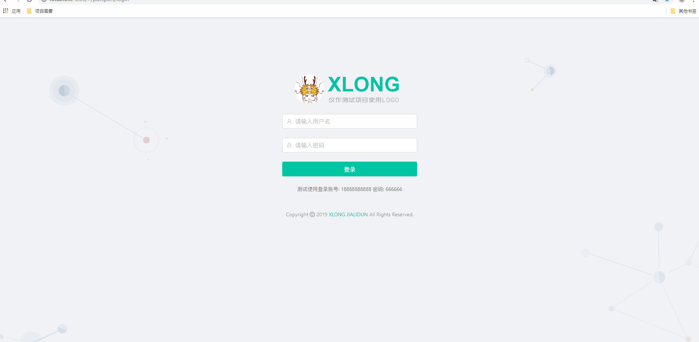
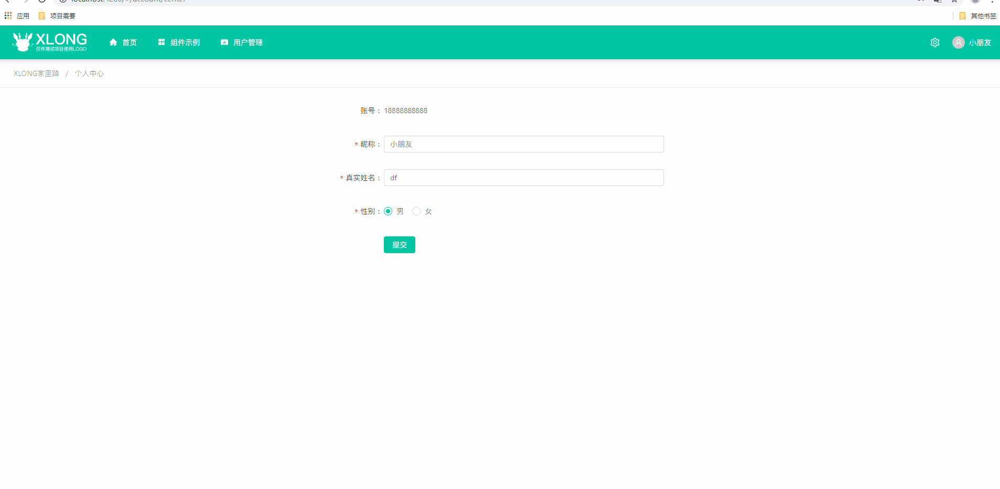
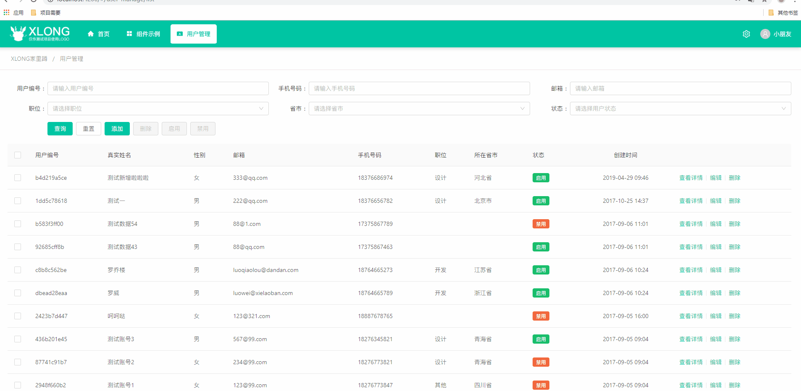
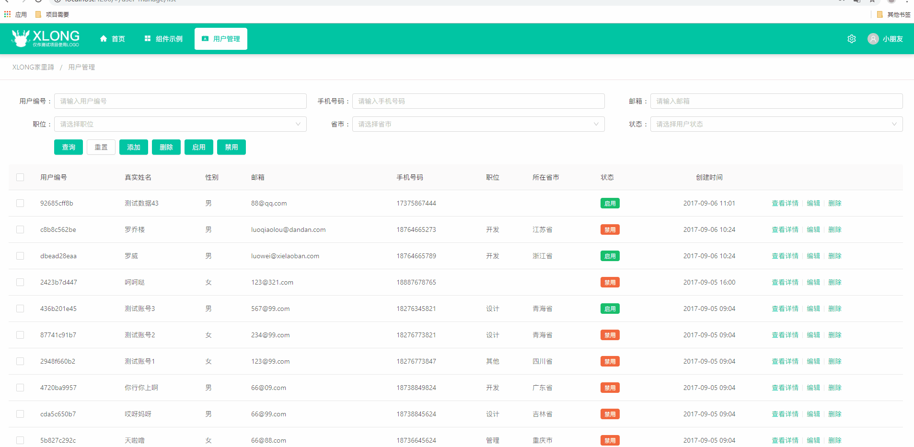
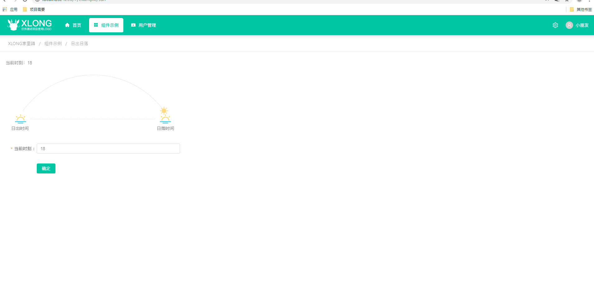

# xlong-admin-angular

## 介绍

xlong-admin-angular 是一套基于 Angular + Ng Alain +Bomb 开发的单页面客户端渲染管理后台系统应用示例。

*仅作学习参考，将持续添加功能

## 项目展示

> DEMO地址：https://xlong1029.github.io/xlong-admin-angular/#/Login

## 项目说明

#### 1. 前后端分离开发模式
- **前端**：Angular + Ng Alain
- **后端**：Bomb

#### 2. 项目用到技术、框架与插件
[angular](https://github.com/angular)<br/>
[ng-alain](https://github.com/ng-alain/ng-alain)<br/>
[ng-zorro-antd](https://github.com/NG-ZORRO/ng-zorro-antd)<br/>

## 部分项目运行截图
* 登录界面



* 个人资料\修改密码



* 用户管理功能





* Cancas示例



## 目录结构

```
│  .editorconfig // 代码编辑器的配置
│  .gitignore
│  .prettierignore
│  .prettierrc
│  .stylelintrc
│  angular.json // 为工作区中的所有项目指定 CLI 的默认配置，可添加第三方插件/字体包
│  browserslist // 配置各种前端工具之间共享的目标浏览器和 Node.js 版本
│  karma.conf.js
│  package.json
│  package-lock.json
│  proxy.conf.json
│  tsconfig.app.json
│  tsconfig.json // 工作空间中各个项目的默认 TypeScript 配置，可定义路径别名
│  tsconfig.spec.json
│  tslint.json
│  README.md
│
├─src
│  │  favicon.ico // 应用图标
│  │  hmr.ts // 热更新配置
│  │  index.html // 首页入口文件
│  │  main.ts // 项目入口，可在此配置Bmob服务
│  │  polyfills.ts // 引用的ES6/ES7方法可以放在这里
│  │  style-icons.ts // 手动配置的 nz-zorro 图标
│  │  style-icons-auto.ts // 通过指令配置的 nz-zorro 图标
│  │  styles.less
│  │  test.ts
│  │  typings.d.ts
│  │
│  ├─assets // 资源目录，这里的资源会被构建
│  ├─common // 通用配置
│  ├─environments // 环境配置
│  ├─bmob // Bmob后端云配置
│  │  bmob-server.ts // 封装bmob的增删改查数据方法 
│  │
│  ├─styles // 可覆盖ng-alain样式配置
│  │  index.less // 通用样式
│  │  theme.less // 主题样式
│  │
│  └─app
│     │  app.component.ts
│     │  app.global.ts // 配置全局变量
│     │  app.module.ts
│     │  app-routing.module.ts
│     │  delon.module.ts
│     │
│     ├─core
│     │  │   index.ts
│     │  │   core.module.ts
│     │  │   module-import-guard.ts
│     │  │   README.md
│     │  │
│     │  ├─net // 网络配置
│     │  └─startup // 项目启动配置
│     │
│     ├─layout // 页面布局相关模块
│     │
│     ├─routes // 路由相关模块
│     │  │  routes.module.ts
│     │  │  routes-routing.module.ts // 路由配置
│     │  │
│     │  ├─admin // 管理后台相关页面
│     │  │  ├─account // 个人设置页面
│     │  │  ├─example // 示例相关页面
│     │  │  ├─home // 后台主页
│     │  │  └─user-manage // 用户管理相关页面
│     │  │
│     │  ├─callback // 回调页面
│     │  ├─dashboard // 仪表盘页面（已废弃使用，改用admin/home）
│     │  ├─exception // 异常相关页面
│     │  ├─passport // 通行认证相关页面（包括登录、注册）
│     │  ├─guard // 路由守卫配置
│     │  └─public // 公用模块
│     │
│     └─shared
│        │  index.ts
│        │  shared.module.ts
│        │
│        ├─directive // 自定义指令
│        ├─pipe // 自定义管道
│        ├─utils // 自定义工具箱
│        └─json-schema
│
├─scripts
│
├─e2e
│
└─_mock // mock请求文件
```

## 本地运行
1. 安装前台依赖
> npm install

2. 运行项目
* 默认端口启动：
> npm start

访问地址：http://localhost:4200

* 自定义端口启动：
> ng serve --port 4201 --open

访问地址：http://localhost:4201，--open 指令会自动启动浏览器

## 项目测试
> npm run test

## 项目打包
> npm run build

## Angular官方项目学习
在线例子： https://stackblitz.com/angular/vmeynjlxkqa

## 作者联系方式

QQ：381612175
TEL: 18376686974

github：https://github.com/xLong1029/

站酷主页：http://xlong.zcool.com.cn/

UI中国：http://i.ui.cn/ucenter/358591.html

* 此项目做学习Angular测试使用，有什么问题可联系我讨论
